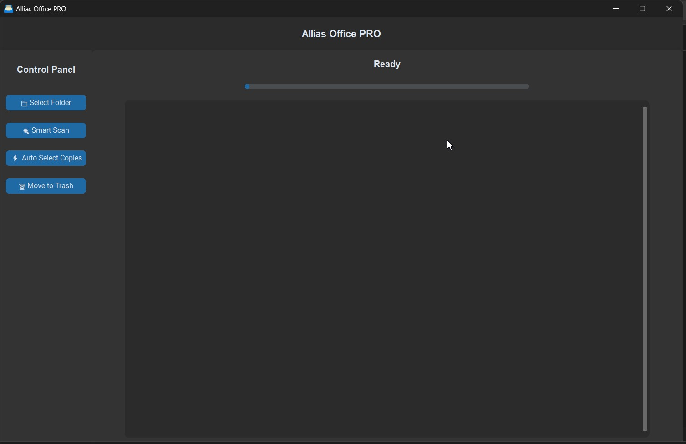
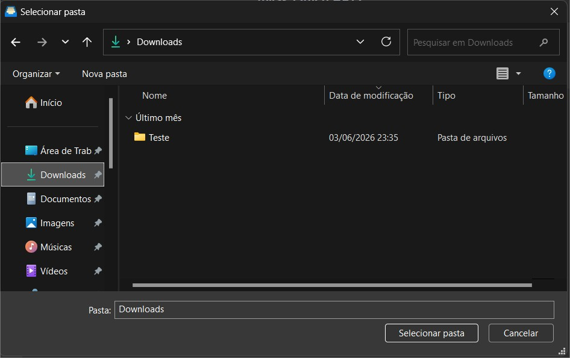
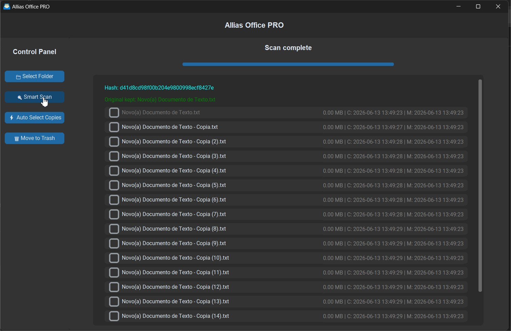
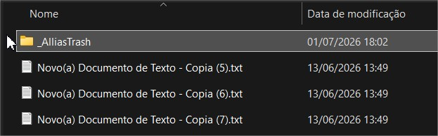

<p align="center">


# Allias Office PRO

**Professional Duplicate File Finder**

*Fast • Intelligent • Safe*


</p>

---

# 🌎 Language | Idioma

* 🇧🇷 [Português](#-português)
* 🇺🇸 [English](#-english)

---

# 🇧🇷 Português

## 📖 Sobre o Projeto

O **Allias Office PRO** é uma aplicação desktop desenvolvida em Python para localizar arquivos duplicados de maneira rápida, inteligente e segura.

Ao contrário de programas tradicionais que simplesmente comparam arquivos pelo nome, o Allias Office PRO utiliza um processo de múltiplas etapas para garantir precisão e alto desempenho, reduzindo significativamente o tempo de processamento em grandes diretórios.

O software foi projetado para preservar automaticamente o arquivo considerado mais provável como original, utilizando critérios forenses como:

* Data de criação
* Data de modificação
* Ordem em que o arquivo foi encontrado
* Caminho do arquivo (desempate)

As demais cópias podem ser movidas com segurança para uma pasta de recuperação, evitando exclusões permanentes.

---

# ✨ Principais Recursos

✔ Interface moderna desenvolvida com CustomTkinter

✔ Varredura recursiva de diretórios

✔ Localização rápida de arquivos duplicados

✔ Filtro inicial por tamanho

✔ Hash MD5 parcial para acelerar a análise

✔ Confirmação por hash MD5 completo

✔ Identificação automática do arquivo original

✔ Exibição de metadados completos

✔ Barra de progresso

✔ Seleção automática das cópias

✔ Movimentação segura para lixeira própria

✔ Arquitetura simples e leve

✔ Fácil manutenção

---

# 🚀 Como Funciona

O algoritmo foi desenvolvido para minimizar processamento desnecessário.

## 1. Leitura da Pasta

Todos os arquivos do diretório escolhido são indexados.

---

## 2. Comparação por Tamanho

Arquivos com tamanhos diferentes jamais podem ser iguais.

Assim, apenas arquivos de mesmo tamanho continuam na análise.

Essa etapa elimina milhares de comparações desnecessárias.

---

## 3. Hash Parcial

Para cada candidato, apenas o primeiro megabyte é utilizado para gerar um hash MD5.

Caso o hash seja diferente, o arquivo é descartado imediatamente.

Isso torna o processo extremamente rápido.

---

## 4. Hash Completo

Somente arquivos que possuem o mesmo hash parcial recebem um cálculo completo do MD5.

Dessa forma a confirmação é praticamente perfeita.

---

## 5. Escolha Inteligente do Original

Quando arquivos idênticos são encontrados, eles são ordenados considerando:

1. Data de criação
2. Data de modificação
3. Ordem da varredura
4. Caminho do arquivo

O primeiro arquivo permanece preservado.

Todos os demais tornam-se candidatos para remoção.

---

## 6. Remoção Segura

Os arquivos não são apagados.

Eles são movidos para:

```text
_AlliasTrash/
```

Assim é possível restaurá-los posteriormente.

---

# 🖼 Interface

A aplicação possui uma interface intuitiva contendo:

* Seleção de pasta
* Barra lateral de controle
* Barra de progresso
* Lista de duplicatas
* Informações detalhadas
* Seleção automática
* Movimentação segura

---

# 📷 Capturas de Tela

### Home



---

### Folder Selection



---

### Smart Scan



---

### Finished



---

# 🛠 Tecnologias Utilizadas

* Python 3
* CustomTkinter
* hashlib
* threading
* shutil
* ctypes
* tkinter
* os
* sys

---

# 📂 Estrutura do Projeto

```text
allias-office-pro/
│
├── assets/
│   └── icon.ico
│
├── screenshots/
│   └── finished.png
│   └── folder-selection.png
│   └── home.png
│   └── scan.png
│
├── src/
│   └── main.py
│
├── .env.example
├── .gitignore
├── CHANGELOG.md
├── LICENSE
├── pyproject.toml
├── README.md
├── requirements.txt
├── version.txt
└── build.bat
```

---

# ⚙ Instalação

Clone o repositório:

```bash
git clone https://github.com/Literallyrodrigo/allias-office-pro.git
```

Entre na pasta:

```bash
cd allias-office-pro
```

Instale as dependências:

```bash
pip install -r requirements.txt
```

Execute:

```bash
python src/main.py
```

---

# 🏗 Gerando o Executável

Caso utilize PyInstaller:

```bash
pyinstaller ^
--onefile ^
--windowed ^
--icon assets/icon.ico ^
--version-file version.txt ^
--add-data "assets;assets" ^
src/main.py
```

---

# 📋 Requisitos

* Python 3.11+
* Windows 10 ou superior
* Pip atualizado

---

# 📈 Roadmap

## Próximas funcionalidades

* SHA-256
* SHA-512
* Hash paralelo
* Multi-thread
* Drag and Drop
* Visualização de imagens
* Comparação de vídeos
* Comparação de PDFs
* Relatórios em CSV
* Relatórios em Excel
* Relatórios em PDF
* Temas personalizados
* Suporte multilíngue
* Undo
* Exclusão de pastas vazias
* Exportação de logs

---

# ❓ FAQ

### O programa apaga meus arquivos?

Não.

Os arquivos são movidos para uma pasta chamada `_AlliasTrash`, permitindo recuperação caso necessário.

### O algoritmo é confiável?

Sim.

A confirmação é realizada utilizando MD5 completo após uma etapa inicial de otimização com hash parcial.

### Posso escanear HDs externos?

Sim.

Qualquer unidade acessível pelo Windows pode ser analisada.

---

# 🤝 Contribuições

Contribuições são muito bem-vindas.

Caso deseje colaborar:

1. Faça um Fork.
2. Crie uma branch.
3. Faça suas alterações.
4. Envie um Pull Request.

Também são bem-vindos:

* sugestões;
* melhorias;
* correções de bugs;
* otimizações.

---

# 📄 Licença

Este projeto está licenciado sob a **MIT License**.

Consulte o arquivo **LICENSE** para mais informações.

---

# 🇺🇸 English

## 📖 About the Project

**Allias Office PRO** is a desktop application developed in Python for fast, intelligent, and secure duplicate file detection.

Instead of simply comparing filenames, the application performs a multi-stage verification process to accurately identify duplicate files while minimizing unnecessary disk operations.

The software automatically preserves the file that is most likely the original using forensic metadata, including:

* Creation date
* Modification date
* Scan order
* File path (fallback)

All remaining copies can be safely moved to a dedicated recovery folder instead of being permanently deleted.

---

# ✨ Features

✔ Modern graphical interface built with CustomTkinter

✔ Recursive directory scanning

✔ Smart duplicate detection

✔ File size filtering

✔ Partial MD5 hashing for high performance

✔ Full MD5 verification

✔ Automatic original file selection

✔ Complete metadata visualization

✔ Progress bar

✔ Automatic duplicate selection

✔ Safe move to recovery folder

✔ Lightweight architecture

✔ Easy maintenance

---

# 🚀 How It Works

The application minimizes unnecessary processing through multiple verification stages.

## 1. Folder Scan

All files inside the selected directory and its subdirectories are indexed.

---

## 2. File Size Filter

Files with different sizes cannot be identical.

Only files sharing the same size continue to the next step.

This eliminates thousands of unnecessary comparisons.

---

## 3. Partial MD5 Hash

Only the first megabyte of every candidate file is hashed.

If two partial hashes differ, the files are immediately discarded.

This dramatically increases scanning speed.

---

## 4. Full MD5 Verification

Only files with identical partial hashes receive a complete MD5 calculation.

This guarantees extremely reliable duplicate detection.

---

## 5. Intelligent Original Selection

When duplicates are confirmed, they are sorted using the following priority:

1. Oldest creation date
2. Oldest modification date
3. Scan order
4. File path

The first file is preserved.

The remaining files become duplicate candidates.

---

## 6. Safe Removal

Duplicate files are never permanently deleted.

Instead, they are moved to:

```text
_AlliasTrash/
```

This allows recovery whenever necessary.

---

# 🖥 Interface

The application provides a clean and intuitive desktop interface including:

* Folder selection
* Control panel
* Progress bar
* Duplicate list
* Metadata display
* Automatic selection
* Safe duplicate removal

---

# 📸 Screenshots

### Home


---

### Folder Selection


---

### Smart Scan


---

### Finished


---

# 🛠 Built With

* Python 3
* CustomTkinter
* hashlib
* threading
* shutil
* ctypes
* tkinter
* os
* sys

---

# 📁 Project Structure

```text
allias-office-pro/
│
├── assets/
│   └── icon.ico
│
├── screenshots/
│   └── finished.png
│   └── folder-selection.png
│   └── home.png
│   └── scan.png
│
├── src/
│   └── main.py
│
├── .env.example
├── .gitignore
├── CHANGELOG.md
├── LICENSE
├── pyproject.toml
├── README.md
├── requirements.txt
├── version.txt
└── build.bat
```

---

# ⚙ Installation

Clone the repository:

```bash
git clone https://github.com/Literallyrodrigo/allias-office-pro.git
```

Enter the project folder:

```bash
cd allias-office-pro
```

Install the dependencies:

```bash
pip install -r requirements.txt
```

Run the application:

```bash
python src/main.py
```

---

# 🏗 Building the Executable

Using PyInstaller:

```bash
pyinstaller ^
--onefile ^
--windowed ^
--icon assets/icon.ico ^
--version-file version.txt ^
--add-data "assets;assets" ^
src/main.py
```

---

# 📋 Requirements

* Python 3.11 or newer
* Windows 10 or later
* Updated pip

---

# 🗺 Roadmap

Planned improvements include:

* SHA-256 support
* SHA-512 support
* Parallel hashing
* Multi-thread scanning
* Drag & Drop
* Image preview
* Video comparison
* PDF comparison
* CSV reports
* Excel reports
* PDF reports
* Theme customization
* Multi-language support
* Undo feature
* Empty folder cleanup
* Logging system

---

# ❓ Frequently Asked Questions

### Does the application permanently delete my files?

No.

Selected duplicates are safely moved to the `_AlliasTrash` folder.

---

### Is duplicate detection reliable?

Yes.

A complete MD5 hash is calculated after the optimized partial hash stage, ensuring highly accurate results.

---

### Can I scan external drives?

Yes.

Any storage device accessible by Windows can be scanned.

---

# 🤝 Contributing

Contributions are always welcome.

If you'd like to improve the project:

1. Fork the repository.
2. Create a new feature branch.
3. Commit your changes.
4. Submit a Pull Request.

Bug reports, feature requests and optimizations are greatly appreciated.

---

# 📄 License

This project is licensed under the MIT License.

See the **LICENSE** file for additional information.

---

# 👨‍💻 Autor | Author

## 🇧🇷 Português

### Rodrigo Teixeira

**Cientista da Computação**
Graduado em Ciência da Computação (2026)

Desenvolvedor de software apaixonado por tecnologia, engenharia de software e desenvolvimento de soluções que unem desempenho, qualidade e simplicidade.

Tenho interesse especial no desenvolvimento de aplicações utilizando Python, automação de processos, interfaces desktop, APIs, Inteligência Artificial e Visão Computacional.

Este projeto foi desenvolvido com foco em desempenho, organização de código e boas práticas de desenvolvimento, buscando oferecer uma ferramenta confiável para identificação e gerenciamento de arquivos duplicados.

### Áreas de Interesse

* Python e Java
* Engenharia de Software
* Desenvolvimento Desktop
* Automação de Processos
* APIs REST
* Inteligência Artificial
* Visão Computacional

---

### Contato

**GitHub**

https://github.com/Literallyrodrigo

**LinkedIn**

https://www.linkedin.com/in/rodrigoteixeira-dev/

---

## 🇺🇸 English

### Rodrigo Teixeira

**Computer Scientist**
Bachelor's Degree in Computer Science (2026)

Software developer passionate about technology, software engineering and building reliable, efficient and well-designed applications.

My main interests include Python development, desktop applications, process automation, APIs, Artificial Intelligence and Computer Vision.

This project was created with a strong focus on performance, code quality and software engineering best practices, aiming to provide a reliable duplicate file management solution.

### Areas of Interest

* Python and Java Development
* Software Engineering
* Desktop Applications
* Process Automation
* REST APIs
* Artificial Intelligence
* Computer Vision

---

### Contact

**GitHub**

https://github.com/Literallyrodrigo

**LinkedIn**

https://www.linkedin.com/in/rodrigoteixeira-dev/

---

# 🌟 Why this project?

## 🇧🇷

Grandes diretórios frequentemente acumulam múltiplas cópias do mesmo arquivo, desperdiçando espaço de armazenamento e dificultando a organização.

O Allias Office PRO nasceu com o objetivo de oferecer uma solução rápida, intuitiva e confiável para identificar arquivos duplicados, preservando automaticamente o arquivo mais provável como original.

O projeto também representa a aplicação prática de conceitos de algoritmos, estruturas de dados, sistemas de arquivos, desenvolvimento desktop e engenharia de software.

---

## 🇺🇸

Large directories often accumulate multiple copies of the same file, wasting storage space and making organization more difficult.

Allias Office PRO was created to provide a fast, intuitive and reliable solution for duplicate file detection while preserving the most probable original file.

The project also demonstrates practical applications of algorithms, data structures, file systems, desktop development and software engineering principles.

---

# 🚀 Future Goals

## 🇧🇷

As próximas versões poderão incluir:

* Detecção de imagens semelhantes utilizando IA
* Comparação perceptual (Perceptual Hash)
* Comparação de vídeos
* Comparação de documentos PDF
* Relatórios em PDF, Excel e CSV
* Sistema de plugins
* Internacionalização completa
* Atualizações automáticas
* Interface ainda mais moderna
* Suporte multiplataforma (Windows, Linux e macOS)

---

## 🇺🇸

Future versions may include:

* AI-powered similar image detection
* Perceptual Hash comparison
* Video comparison
* PDF document comparison
* PDF, Excel and CSV reports
* Plugin architecture
* Full internationalization
* Automatic updates
* Enhanced user interface
* Cross-platform support (Windows, Linux and macOS)

---

# 🤝 Acknowledgements

## 🇧🇷

Agradecimentos à comunidade Python e aos desenvolvedores das bibliotecas open source que tornam projetos como este possíveis.

---

## 🇺🇸

Special thanks to the Python community and to all open-source contributors whose work makes projects like this possible.

---

# ⭐ Support the Project

## 🇧🇷

Se este projeto foi útil para você, considere deixar uma estrela no repositório.

Isso ajuda outras pessoas a encontrarem o projeto e incentiva seu desenvolvimento contínuo.

---

## 🇺🇸

If you found this project useful, consider giving it a star on GitHub.

Your support helps the project reach more developers and motivates future improvements.

---

<p align="center">

Developed with ❤️ using Python.
Thanks God and Jesus for everything.

**© 2026 Rodrigo Teixeira**

</p>
